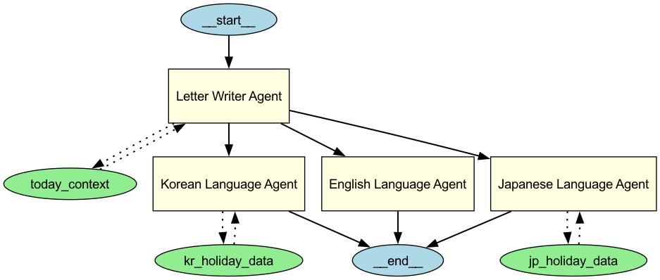

# ✉️ AI QnA with Your Sentiment

## 📌 Description
AI에게 편지나 메세지를 보내면, 감정을 분석하고 적절한 반응 편지를 자동으로 작성해주는 서비스입니다.  
OpenAI GPT API와 Hugging Face Sentiment 모델을 기반으로 하여 편지 작성, 감정 분석, 그리고 다국어 대응 편지를 제공합니다.

Chat 기능 (QnA) 추후 추가 예정

## 🧠 주요 기능
- Google OAuth2 로그인
- 편지 작성 및 저장 (MongoDB)
- HuggingFace 감정 분석 모델로 감정 추출
- OpenAI LLM을 통한 감성 편지 자동 작성
- 읽음 처리 및 답장 기능
- 다국어 대응 (한국어 / 영어 / 일본어)

## 🧑‍💻 미구현 추가 예정 기능
- 사용자 감정 히스토리 기반 자동 응답
- 챗 기능 (QnA)
- 자동 번역 펜팔 서비스
- 감정밀도 분석 에이전트 추가

---

## ⚙️ Tech Stack
- Python 3.11
- FastAPI
- Pydantic
- Poetry
- MongoDB / Motor
- Redis
- OpenAI API / Agents SDK
- Hugging Face Transformers
- Docker

---

## 🧩 에이전트 구조


- `SentimentAnalysisAgent`: 슬라이딩 윈도우 기반 감정 분석 및 평가
- `LetterWriterAgent`: 감정과 언어 기반으로 편지를 작성하는 상위 에이전트
  - 협력 에이전트:
    - `KoreanLanguageAgent`
    - `EnglishLanguageAgent`
    - `JapaneseLanguageAgent`
  - 각 에이전트는 국가별 문화와 언어 특성을 반영하여 편지를 작성
- 공통 툴 (Tools)
  - 오늘 날짜 및 요일 컨텍스트 (TimeZone 반영)
  - 국가별 공휴일 정보

---

## 🗂 Project Structure
https://github.com/zhanymkanov/fastapi-best-practices

위 프로젝트 구조를 참고하여 프로젝트 구조를 설계하였습니다.

```
src/
├── auth/               # 인증 및 유저 관련 모듈
├── letter/             # 편지 작성, 저장, 읽음 처리
├── sentiment/          # 감정 분석 관련 에이전트 및 클라이언트
├── writer/             # 편지 작성 에이전트
├── agents/             # 공통 에이전트 및 툴 정의
├── config.py           # 환경 설정
├── main.py             # FastAPI 엔트리 포인트
```

---

## 🧪 실행 방법

### Poetry 환경 구성
```bash
poetry install
poetry shell
```

### 환경 변수 설정 (.env)
```
SECRET_KEY=...
GOOGLE_CLIENT_ID=...
GOOGLE_CLIENT_SECRET=...
GOOGLE_REDIRECT_URI=http://localhost:8000/auth/google/callback
OPENAI_API_KEY=...
```

---

## 🧭 개발 회고 (DevLog)
- **타입 관리**: `Pydantic`, `Dataclass`, `TypedDict` 를 상황에 맞게 구분해 사용 → [블로그 포스트](https://baecode.tistory.com/73)
- **에이전트 설계**: 단순 호출을 넘어서 다국어 에이전트 분기 및 툴 처리까지 고려 → [블로그 포스트](https://baecode.tistory.com/84)
- **감정 분석**: 단일 문장보다는 문맥을 고려한 슬라이딩 윈도우 방식이 더 정확함
- **성능 고려**: Pydantic v2와 Rust 기반 core 성능 활용, HuggingFace 로컬 예측
- **토큰 최적화**: 프롬프트 내 토큰 수 조절을 통한 LLM 비용 절감

---
